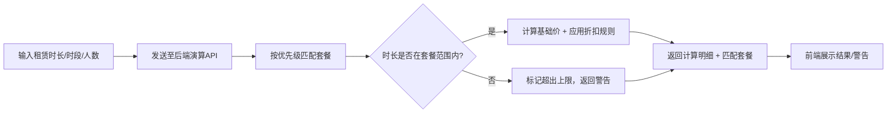

## 1. 产品概述

**自习室租赁套餐规则可视化配置器** — 面向自习室运营工作人员的内部规则调试工具。通过拖拽组件的方式搭建小时套餐、全天套餐、月度套餐三种租赁方案，自定义定价、时长、折扣，并实时演算应付金额，验证计费规则的准确性。

- **目标用户**：自习室运营人员、业务规则配置人员
- **解决问题**：传统计费规则配置需修改代码、无法即时验证、调试周期长
- **核心价值**：可视化拖拽配置 + 实时金额演算 + 超时时长自动拦截，大幅提升规则调试效率

---

## 2. 核心功能

### 2.1 用户角色

| 角色 | 使用场景 | 核心权限 |
|------|----------|----------|
| 运营人员 | 日常规则调试、套餐配置 | 套餐增删改查、拖拽排序、样式调整、金额演算 |

### 2.2 功能模块

1. **套餐配置画布**：左侧组件库 + 中间画布 + 右侧属性面板三段式布局，支持拖拽搭建套餐
2. **套餐属性面板**：编辑单套套餐的定价、时长、折扣规则、优惠文案样式
3. **套餐排序区**：拖拽调整套餐优先级顺序（计费匹配按优先级从上到下）
4. **金额演算调试台**：输入模拟租赁时长 → 实时匹配最优套餐 → 展示计算明细 → 拦截超时时长
5. **样式编辑器**：调整优惠文字的字号、颜色、字重、装饰样式

### 2.3 页面详情

| 页面名称 | 模块名称 | 功能描述 |
|----------|----------|----------|
| 主配置页 | 组件库面板 | 三种套餐模板卡片（小时/全天/月度），拖拽到画布新增套餐 |
| 主配置页 | 套餐画布区 | 展示已配置套餐列表，每套套餐显示名称/价格/时长/折扣摘要 |
| 主配置页 | 套餐排序控制 | 上下箭头或拖拽手柄调整套餐匹配优先级顺序 |
| 主配置页 | 属性编辑面板 | 选中套餐后编辑：基础定价、可用时长（小时/天）、折扣规则（阶梯折扣、满减、时段折扣）、优惠文案 |
| 主配置页 | 样式调整子面板 | 优惠文字：字号滑块、颜色拾取器、粗细切换、下划线/删除线/发光效果 |
| 主配置页 | 金额演算调试台 | 输入租赁时长（小时）、选择时段、人数 → 实时计算并显示最优套餐名称、原价、折扣后金额、节省金额、计费明细 |
| 主配置页 | 超时拦截提示 | 当输入时长超过所有套餐上限时，红色警告提示并禁用"确认计费"按钮 |

---

## 3. 核心流程

### 3.1 套餐配置流程

### 3.2 金额演算流程

---

## 4. 用户界面设计

### 4.1 设计风格

- **主色调**：深靛蓝 `#1E1B4B` + 暖琥珀金 `#F59E0B`，传达专业商务感
- **辅助色**：成功绿 `#10B981`、警告红 `#EF4444`、信息蓝 `#3B82F6`
- **按钮风格**：圆角胶囊形 `rounded-full`，主按钮带渐变光晕，悬停微上浮
- **字体**：标题用 `Playfair Display` 衬线体体现品质，正文用 `Inter` 无衬线体保证可读性
- **布局风格**：三栏卡片式布局，玻璃拟态（glassmorphism）背景面板，柔和阴影层次
- **图标风格**：Lucide 线性图标，统一 20px 尺寸，琥珀金着色

### 4.2 页面设计概览

| 页面/模块 | 设计要素 | 细节描述 |
|-----------|----------|----------|
| 顶部导航栏 | 品牌区 + 状态指示 | 左侧显示系统名称"自习室套餐规则配置器"，右侧连接状态指示灯 |
| 左侧组件库 | 三种套餐卡片 | 悬浮玻璃卡，每张含图标+名称+简述，可拖拽至画布 |
| 中间画布区 | 套餐列表卡片 | 纵向排列，每套套餐有拖拽手柄，选中态为琥珀金边框发光 |
| 右侧属性面板 | 表单编辑器 | 分区折叠展开（定价/时长/折扣/样式），滑块+输入框组合 |
| 底部演算台 | 调试输入+结果卡片 | 输入区左侧深色底，结果区右侧浅色底，金额数字使用 Playfair 大字号 |
| 动画效果 | 拖拽/悬停/切换 | 套餐拖拽时原位置留阴影占位，切换面板有淡入滑出过渡 |

### 4.3 响应式

- **桌面优先设计**：最小支持 1440px 宽度，三栏等比缩放
- **交互优化**：拖拽操作流畅，画布区超长时内部滚动
- **触控支持**：所有操作按钮 ≥ 40px，适配触屏设备

---

## 5. 非功能需求

| 维度 | 指标要求 |
|------|----------|
| 实时性 | 修改定价/时长参数后，计算结果 ≤ 300ms 内刷新 |
| 可用性 | 演算台输入后自动计算，无需手动点击按钮 |
| 隔离性 | 数据仅保存在浏览器本地（localStorage），与其他系统无互通 |
| 端口约定 | 前端调试页 3850，后端演算服务 8850 |
