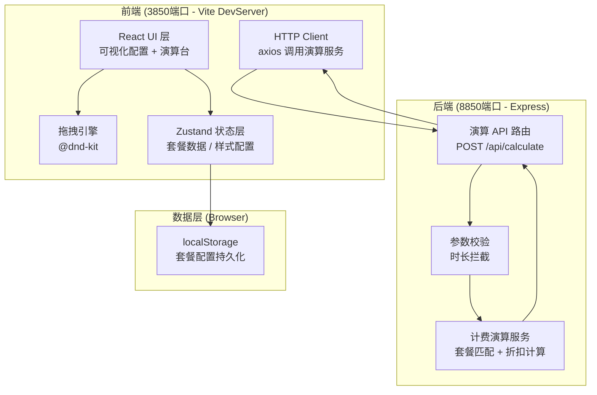
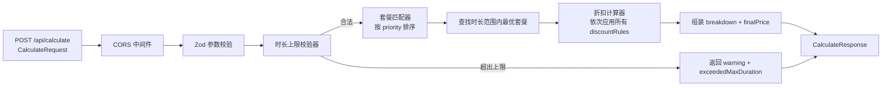

## 1. 架构设计



---

## 2. 技术选型说明

| 层级 | 技术栈 | 版本说明 | 选择理由 |
|------|--------|----------|----------|
| 前端框架 | React 18 + TypeScript | 18.x | 生态成熟，类型安全，适合复杂交互 |
| 构建工具 | Vite | 5.x | 极速热更新，开发体验好 |
| 样式方案 | Tailwind CSS 3 | 3.4.x | 原子化CSS，快速搭建一致UI |
| 状态管理 | Zustand | 4.x | 轻量级，API简洁，持久化易配置 |
| 拖拽引擎 | @dnd-kit/core + @dnd-kit/sortable | 7.x | 性能优异，支持复杂拖拽场景 |
| HTTP 客户端 | Axios | 1.7.x | 拦截器机制完善，类型支持好 |
| 图标库 | Lucide React | 0.390.x | 线性风格统一，按需加载 |
| 后端框架 | Express 4 + TypeScript | 4.19.x | Node.js 标准选择，中间件丰富 |
| 跨域处理 | cors | 2.8.x | 解决 3850 → 8850 跨域 |
| 数据校验 | zod | 3.23.x | TypeScript 原生类型守卫库 |

---

## 3. 路由与端口定义

### 3.1 前端路由（3850端口）

| 路由 | 页面/组件 | 说明 |
|------|-----------|------|
| `/` | Configurator 主页面 | 套餐配置 + 金额演算整合单页 |

### 3.2 后端 API（8850端口）

| 方法 | 路径 | 用途 |
|------|------|------|
| `POST` | `/api/calculate` | 金额演算：传入时长、套餐列表，返回匹配结果和计费明细 |
| `GET` | `/api/health` | 健康检查 |
| `OPTIONS` | `/*` | CORS 预检处理 |

---

## 4. API 定义（TypeScript 类型）

```typescript
// ===== 共享类型 (shared/types.ts) =====

export type PackageType = 'hourly' | 'daily' | 'monthly'

export interface DiscountRule {
  id: string
  type: 'tier' | 'bulk' | 'time-slot'
  name: string
  // tier: 阶梯折扣（按时长阶梯）
  tiers?: { threshold: number; rate: number }[]
  // bulk: 满减（满X元减Y元）
  bulkThreshold?: number
  bulkDiscount?: number
  // time-slot: 时段折扣（某时段额外折扣率）
  slotStartHour?: number
  slotEndHour?: number
  slotRate?: number
}

export interface TextStyleConfig {
  fontSize: number      // px
  color: string
  fontWeight: 100 | 300 | 400 | 500 | 700 | 900
  underline: boolean
  strikethrough: boolean
  glow: boolean
}

export interface RentalPackage {
  id: string
  type: PackageType
  name: string
  description: string
  basePrice: number           // 基础定价（元）
  durationHours: number       // 可用时长（小时）
  maxDurationHours: number    // 时长上限（超过则拦截）
  discountRules: DiscountRule[]
  promoText: string           // 优惠文案
  promoTextStyle: TextStyleConfig
  priority: number            // 匹配优先级（越小越优先）
  enabled: boolean
}

// ===== 请求 / 响应 =====

export interface CalculateRequest {
  rentalHours: number
  startHour?: number          // 租赁起始小时 (0-23)，用于时段折扣
  peopleCount?: number        // 人数（预留扩展）
  packages: RentalPackage[]
}

export interface CalculationBreakdown {
  step: string
  amount: number
  description: string
}

export interface CalculateResponse {
  success: boolean
  matchedPackageId?: string
  matchedPackageName?: string
  originalPrice: number
  finalPrice: number
  savedAmount: number
  breakdown: CalculationBreakdown[]
  warning?: string            // 超时拦截警告信息
  exceededMaxDuration?: boolean
  suggestedMaxHours?: number
}
```

---

## 5. 后端服务架构



### 核心算法

1. **套餐匹配**：按 `priority` 升序遍历，取第一个满足 `rentalHours <= durationHours` 且 `enabled=true` 的套餐
2. **超时拦截**：若 `rentalHours > 所有已启用套餐的 maxDurationHours`，返回拦截
3. **折扣叠加**：基础价 → 应用阶梯折扣 → 应用时段折扣 → 应用满减，生成 step-by-step breakdown

---

## 6. 前端状态模型

### 6.1 Zustand Store

```typescript
interface PackageStore {
  packages: RentalPackage[]
  selectedId: string | null
  draftRequest: {
    rentalHours: number
    startHour: number
    peopleCount: number
  }
  lastResult: CalculateResponse | null

  // Actions
  addPackage: (type: PackageType) => void
  removePackage: (id: string) => void
  updatePackage: (id: string, patch: Partial<RentalPackage>) => void
  reorderPackages: (fromIndex: number, toIndex: number) => void
  selectPackage: (id: string | null) => void
  setDraftRequest: (patch: Partial<DraftRequest>) => void
  calculate: () => Promise<void>
  saveToLocalStorage: () => void
  loadFromLocalStorage: () => void
  resetToDefault: () => void
}
```

### 6.2 组件拆分

```
src/
├── components/
│   ├── layout/
│   │   ├── TopBar.tsx             # 顶部导航
│   │   └── ThreeColumnLayout.tsx  # 三栏布局容器
│   ├── packages/
│   │   ├── ComponentLibrary.tsx   # 左侧组件库
│   │   ├── PackageCanvas.tsx      # 中间套餐画布
│   │   ├── PackageCard.tsx        # 单个套餐卡片（可拖拽）
│   │   └── PackagePropertyPanel.tsx # 右侧属性面板
│   ├── discount/
│   │   ├── DiscountRuleEditor.tsx # 折扣规则编辑器
│   │   └── TextStyleEditor.tsx    # 优惠文字样式编辑器
│   └── calculator/
│       └── CalculationConsole.tsx # 底部金额演算台
├── hooks/
│   ├── useCalculator.ts           # 封装演算调用逻辑
│   └── useDragReorder.ts          # 拖拽排序 hook
├── store/
│   └── usePackageStore.ts
├── services/
│   └── calculationApi.ts
├── utils/
│   ├── defaultPackages.ts         # 默认套餐模板
│   └── formatters.ts              # 金额/时长格式化
├── App.tsx
└── main.tsx
```

---

## 7. 开发环境与启动命令

| 环境 | 端口 | 启动命令 |
|------|------|----------|
| 前端 Vite 开发服务 | 3850 | `npm run dev:frontend` → `vite --port 3850` |
| 后端 Express (ts-node) | 8850 | `npm run dev:backend` → `ts-node api/server.ts` |
| 并行启动 | 3850 + 8850 | `npm run dev` → `concurrently` 并行启动 |
| 类型检查 | - | `npm run check` → `tsc --noEmit` |
| 构建生产包 | - | `npm run build` |
